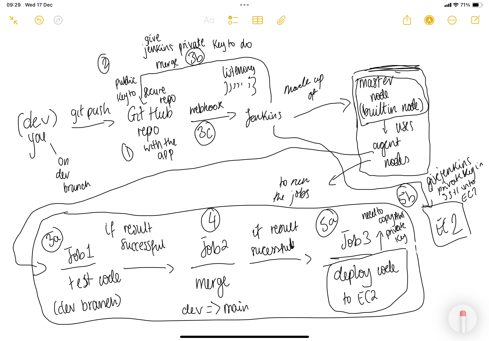

# Introduction to CI/CD and Jenkins

## What is CI? (Continuous Integration)

**Continuous Integration (CI)** is the practice of frequently integrating code changes into a shared repository.

### How CI works

* Developers frequently push code changes to a shared repository
* Each push automatically triggers a CI pipeline
* Automated tests are run on the new code
* Code is merged only if tests pass

### Benefits of CI

* Helps identify and resolve bugs early
  * Reduces the cost of fixing issues
* Maintains a stable and functional software build
* Improves collaboration between developers
* Reduces integration problems late in development

## What is CD? (Continuous Delivery vs Continuous Deployment)

CD can refer to **Continuous Delivery** *or* **Continuous Deployment**.

### Continuous Delivery (manual sign-off / approval)

* Ensures software is always in a deployable state
* Code can be released to production at any time
* Produces a deployable artifact
* Requires a **manual approval** step before production release

**Benefits:**

* Always have a deployable artifact ready
* More control over production releases
* Reduced deployment risk

### Continuous Deployment (fully automated)

* Extends Continuous Delivery by automating deployment to production
* No manual intervention required
* Every successful change is deployed automatically

**Benefits (and drawbacks):**

* Faster delivery to users
* Removes the need for human approval
* Relies entirely on automated testing and processes

## What is Jenkins?

* An open-source automation server
* Primarily used to implement CI/CD pipelines
* Can automate a wide range of tasks beyond CI/CD

## Why use Jenkins?

### Benefits

* Automation of build, test, and deployment processes
* Extensibility: over 1,000 plugins available
* Scalability: supports worker nodes/agents to run jobs in parallel
* Strong community support
* Highly customizable
* Cross-platform: works on Windows, Linux, and macOS

### Disadvantages

* Can be complex for beginners to set up
* Requires ongoing maintenance
* Resource-intensive when running many jobs
* User interface can feel outdated

## Stages of a Jenkins CI/CD Pipeline

A typical Jenkins pipeline includes the following stages:

1. **Source Code Management** – Fetch code from a repository
2. **Build** – Compile the code and create executables
3. **Test** – Run automated tests (unit, integration, etc.)
4. **Package** – Create a deployable artifact
5. **Deploy** *(Continuous Deployment only)* – Deploy to target environments (e.g. staging, production)
6. **Monitor** *(Continuous Deployment only)* – Monitor performance, logs, and system health

## Alternatives to Jenkins

* GitLab CI
* GitHub Actions
* CircleCI
* Travis CI
* Bamboo
* TeamCity
* GoCD
* Azure DevOps (Azure Pipelines)

## Why Build a Pipeline? (Business Value)

* Cost savings through automation of repetitive processes
* Faster time to market
* Reduced deployment risk
* Improved software quality through continuous feedback and testing
