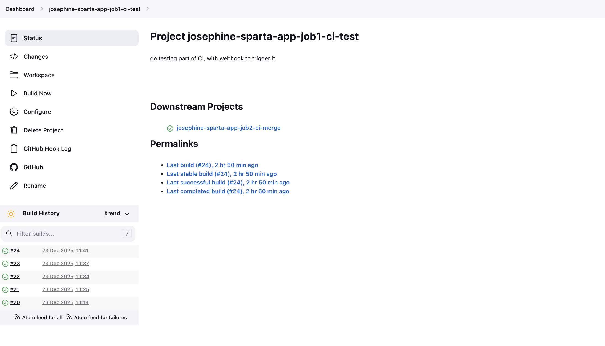
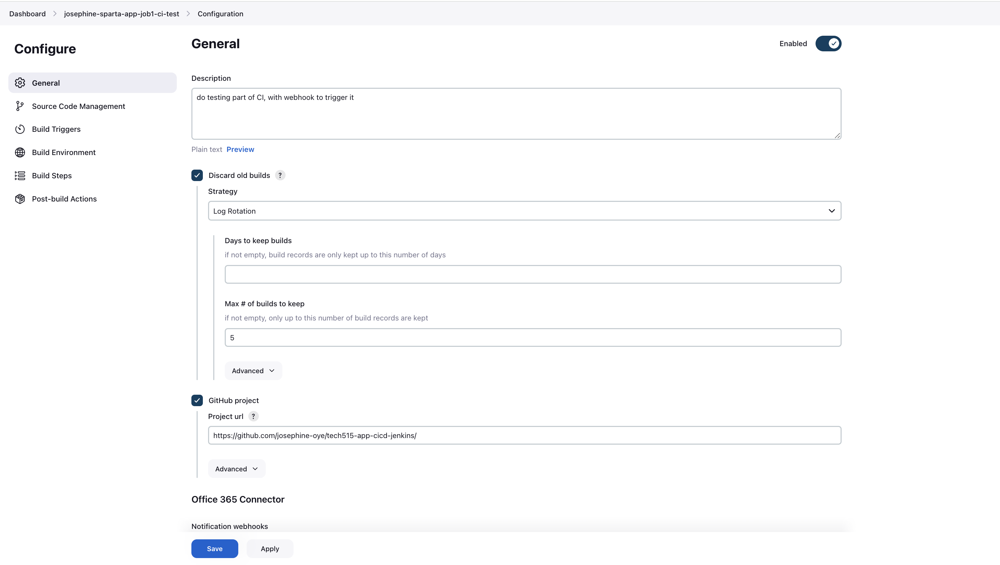
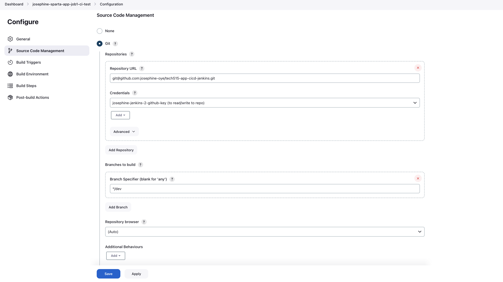
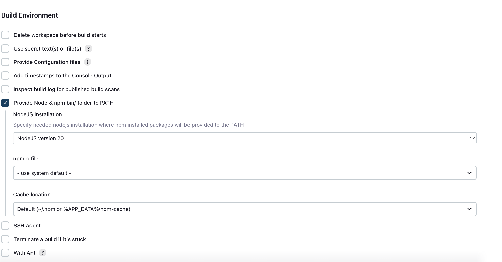

# Job 1 – CI Test (Build & Test Pipeline)

- [Job 1 – CI Test (Build \& Test Pipeline)](#job-1--ci-test-build--test-pipeline)
  - [Purpose of Job 1](#purpose-of-job-1)
  - [Creating Job 1 in Jenkins](#creating-job-1-in-jenkins)
    - [Step 1: Create the Job](#step-1-create-the-job)
  - [General Configuration](#general-configuration)
  - [Discard Old Builds](#discard-old-builds)
      - [Configuration](#configuration)
    - [GitHub Project](#github-project)
  - [Source Code Management](#source-code-management)
  - [Build Environment](#build-environment)
  - [Build Steps](#build-steps)
    - [Execute Shell](#execute-shell)
    - [What this does](#what-this-does)
  - [Build Trigger](#build-trigger)
  - [Key Takeaways](#key-takeaways)

## Purpose of Job 1

Job 1 is responsible for **running automated tests whenever code is pushed** to the repository.

It acts as a **quality gate**, ensuring that only working code is allowed to progress to the merge and deployment stages of the CI/CD pipeline.




## Creating Job 1 in Jenkins

### Step 1: Create the Job

1. Open **Jenkins**
2. Click **New Item**
3. Enter job name:
```

josephine-sparta-app-job1-ci-test

```
4. Select **Freestyle project**
5. Click **OK**


## General Configuration

## Discard Old Builds

To prevent Jenkins from storing unnecessary build history and using excess disk space, old builds are discarded.

#### Configuration

- Enable: **Discard old builds**
- Set:
Max # of builds to keep: 5


### GitHub Project

- Tick **GitHub project**
- Enter the repository URL **without `.git`** and ending with `/`

Example:
```
https://github.com/josephine-oye/tech515-app-cicd-jenkins.git

```

This allows Jenkins to link builds back to GitHub.

 

## Source Code Management

1. Select **Git**
2. Repository URL (must be SSH):
```
git@github.com:josephine-oye/tech515-app-cicd-jenkins.git

```
3. Add credentials:
- Kind: **SSH Username with private key**
- ID & Username: `josephine-jenkins-2-github-key`
- Description: Read/write access to repo
- Private key: *Enter directly* (copied from GitHub key)
4. Branch specifier:
```
*/dev
```
Use this link for instructions on how to _[Make dev branch](make_dev_branch.md)_ 

Using SSH ensures Jenkins can securely access the repository.



## Build Environment

- Enable: **Provide Node & npm bin/ folder to PATH**
- Select NodeJS version:
  
```
NodeJS 20
```

This ensures the correct runtime environment is available for the app.



## Build Steps

### Execute Shell

Add **Execute shell** and include:

```
cd app
npm install
npm test
```

### What this does

* `cd app` → moves into the application directory
* `npm install` → installs dependencies
* `npm test` → runs automated tests

If any test fails, the job fails.


## Build Trigger

Job 1 is triggered automatically by **GitHub webhooks** whenever code is pushed.

This ensures tests run without manual intervention. Use Link Below: 

[Setup webook to trigger job 1](webhook.md)

## Key Takeaways

* Job 1 protects the pipeline from broken code
* Automated testing enforces consistency
* Forms the foundation of the CI/CD workflow
