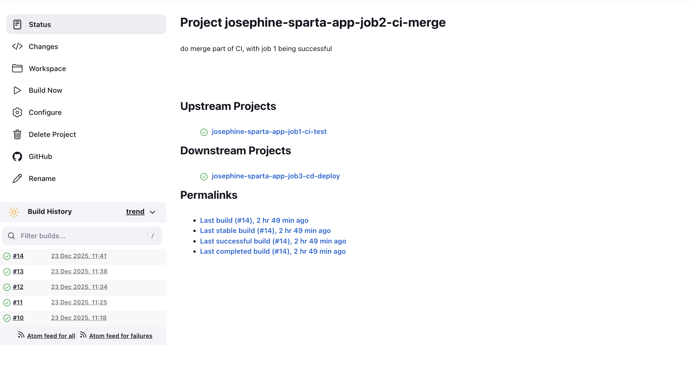
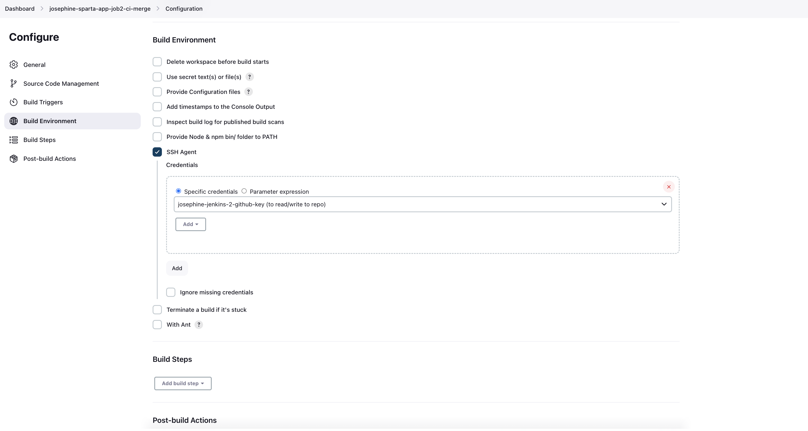
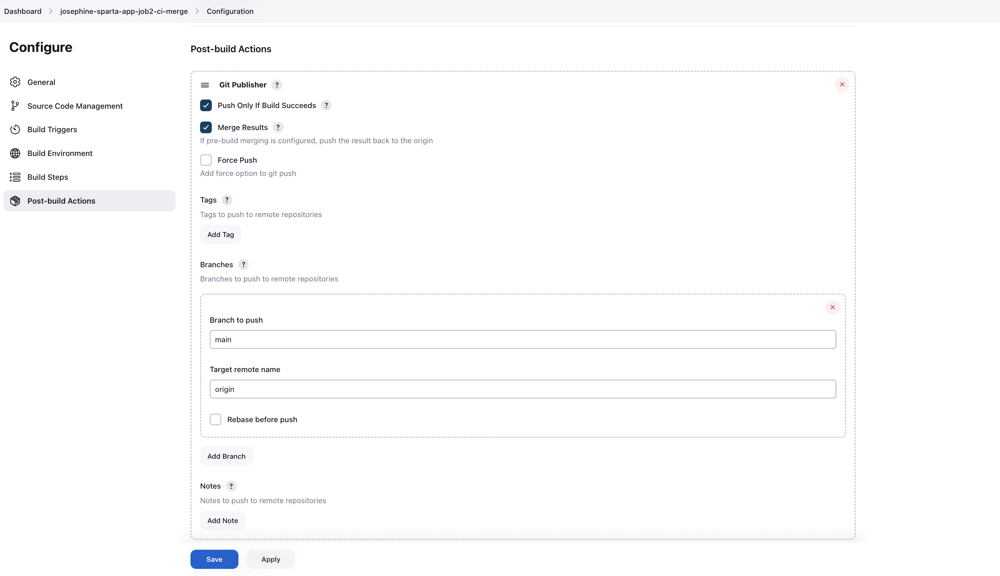

# Job 2 – CI Merge (dev -> main)

- [Job 2 – CI Merge (dev -\> main)](#job-2--ci-merge-dev---main)
  - [Purpose of Job 2](#purpose-of-job-2)
  - [Pre-requisites](#pre-requisites)
  - [Trigger Configuration](#trigger-configuration)
  - [Method 1 – Execute Shell (Manual Git Commands)](#method-1--execute-shell-manual-git-commands)
    - [Source Code Management](#source-code-management)
    - [Build Step – Execute Shell](#build-step--execute-shell)
    - [Blockers \& Resolutions](#blockers--resolutions)
      - [1. SSH / Permission Denied on `git push`](#1-ssh--permission-denied-on-git-push)
      - [2. Local `dev` branch missing](#2-local-dev-branch-missing)
    - [SSH Notes](#ssh-notes)
  - [Method 2 – Git Publisher (Recommended)](#method-2--git-publisher-recommended)
    - [Why Git Publisher](#why-git-publisher)
    - [Configuration](#configuration)
    - [What Git Publisher Does](#what-git-publisher-does)
  - [Key Takeaways](#key-takeaways)

## Purpose of Job 2

Job 2 is responsible for **merging tested code from the `dev` branch into the `main` branch**.

- Runs **only if Job 1 (CI tests) succeeds**  
- Ensures untested or broken code is **never merged into main**  

Job 2 **does not deploy** or run tests - its sole responsibility is **branch merging**.



## Pre-requisites

- Job 1 (`<yourname>-job1-ci-test`) working and passing
- `dev` branch pushed to GitHub
- Jenkins credentials with **read/write** access to the repo via SSH


## Trigger Configuration

In **Job 2 → Configure → Build Triggers**:

- Enable: **Build after other projects are built**
- Project to watch:  
```

josephine-sparta-app-job1-ci-test

```
- Trigger only if build is **Stable**

This ensures Job 2 runs **only after Job 1 passes**.


## Method 1 – Execute Shell (Manual Git Commands)

### Source Code Management

- Repository URL: your GitHub repo
- Credentials: SSH key with read/write access
- Branch specifier:  
```

*/dev

```

Jenkins checks out the `dev` branch initially.


### Build Step – Execute Shell

```
# Switch to main
git checkout main
git pull origin main

# Merge remote dev branch
git merge origin/dev

# Push merged main back to GitHub
git push origin main
```


### Blockers & Resolutions

During Job 2 implementation, several issues were encountered:

#### 1. SSH / Permission Denied on `git push`

**Error:**
```

[git@github.com](mailto:git@github.com): Permission denied (publickey)
fatal: Could not read from remote repository.

```

**Cause:**

- Jenkins shell was trying to push with a key **not loaded into SSH agent**
- Adding the key in Source Code Management alone was not enough

**Resolution:**

- Use **Git Publisher** (handles authentication automatically), OR
- Configure **SSH Agent plugin** and load the correct credentials during shell execution

#### 2. Local `dev` branch missing

**Error:**
```

merge: dev - not something we can merge
Did you mean this?
origin/dev

```

**Cause:**

- Only the remote-tracking branch `origin/dev` existed in Jenkins workspace
- No local `dev` branch was present

**Resolution:**

- Use:
```
git merge origin/dev
```

* Avoid `git merge dev` unless a local branch is created first


### SSH Notes

* Adding a private key in **Source Code Management** is **not enough** for shell-based `git push`
* Jenkins must have **SSH Agent enabled** and credentials accessible during shell execution

This complexity led to the alternative approach.


## Method 2 – Git Publisher (Recommended)

### Why Git Publisher

* Avoids SSH permission issues in shell scripts
* Jenkins handles authentication automatically
* Cleaner and safer for assessment and production pipelines


### Configuration

1. Build environment → **SSH Agent**:
  Add your ssh key pair that you added to credentials
  

2. Post-build Actions → **Git Publisher**:

* Enable: **Push only if build succeeds**
* Branches to push:

  * Branch: `main`
  * Target remote: `origin`
* Enable: **Merge before push**

  * Merge target:

    ```
    origin/main
    ```

### What Git Publisher Does

1. Takes checked-out `dev` code
2. Merges it into `main`
3. Pushes `main` back to GitHub
4. Runs automatically **only if Job 1 passes**
   

## Key Takeaways

* Job 2 is solely for merging `dev → main`
* Use `origin/dev` in Jenkins shell scripts if needed
* Git Publisher is the **cleanest, safest, and preferred method**
* Demonstrates **iteration, problem-solving, and tool knowledge**

