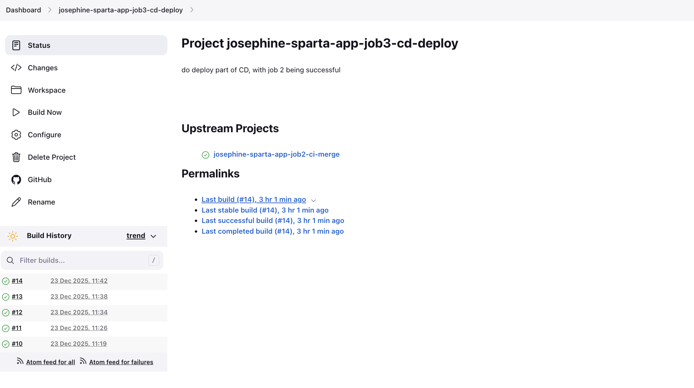
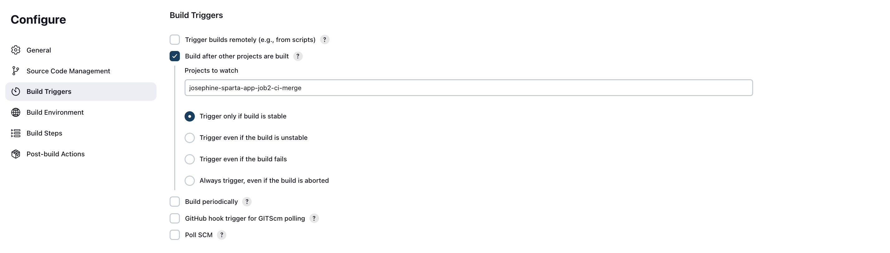
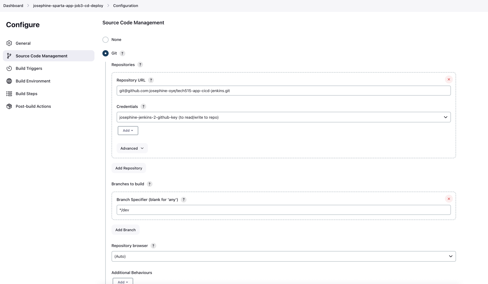
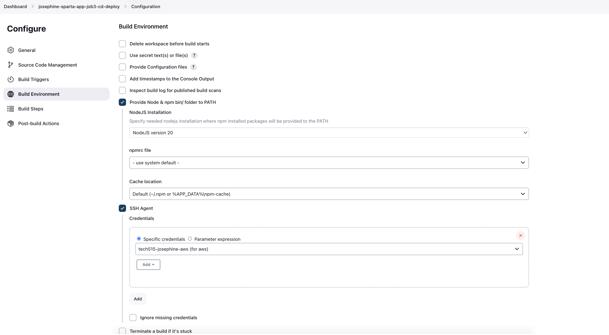
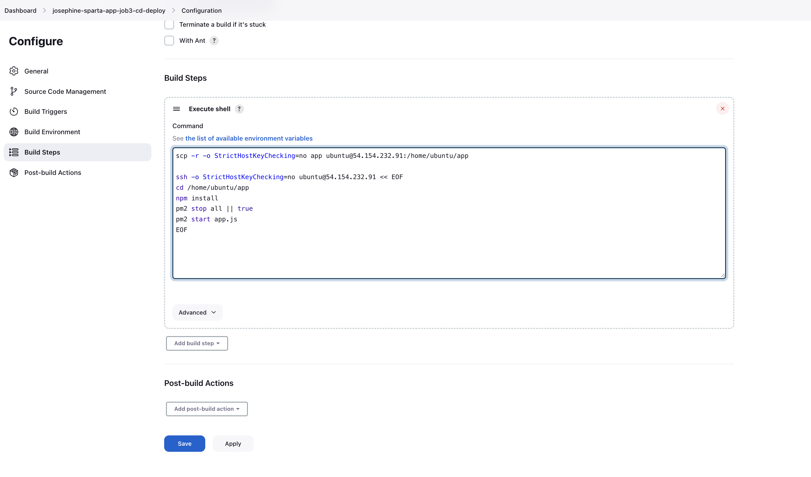
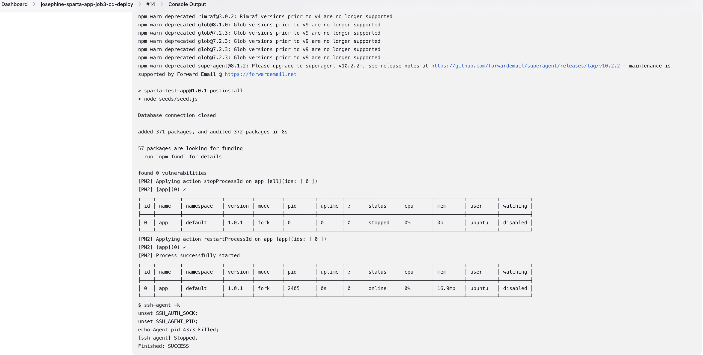
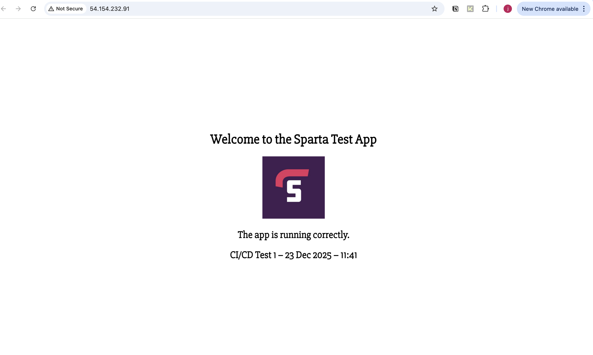

# Job 3 – CD Deploy (Continuous Deployment)
- [Job 3 – CD Deploy (Continuous Deployment)](#job-3--cd-deploy-continuous-deployment)
  - [Purpose of Job 3](#purpose-of-job-3)
  - [Trigger Configuration](#trigger-configuration)
    - [Configuration](#configuration)
  - [Source Code Management](#source-code-management)
    - [Configuration](#configuration-1)
  - [Build Environment Configuration](#build-environment-configuration)
    - [NodeJS Environment](#nodejs-environment)
    - [SSH Agent](#ssh-agent)
  - [Build Steps – Deployment Logic](#build-steps--deployment-logic)
    - [Execute Shell](#execute-shell)
      - [What the Deployment Script Does](#what-the-deployment-script-does)
  - [Successful Deployment Evidence](#successful-deployment-evidence)
  - [Key Takeaways](#key-takeaways)

## Purpose of Job 3

Job 3 is responsible for **deploying the application to a live AWS EC2 instance** once the code has:

1. Passed automated testing in **Job 1**
2. Been successfully merged from `dev` into `main` in **Job 2**

This job completes the **Continuous Deployment (CD)** stage of the CI/CD pipeline by automatically updating the running application without manual server interaction.

Job 3 does **not** run tests or perform merges. Its sole responsibility is **deployment**.

Job 3 only runs when Job 2 completes successfully, ensuring that **only tested and approved code is deployed**.

## Trigger Configuration

Job 3 is triggered automatically by Jenkins.



### Configuration

- Enable: **Build after other projects are built**
- Project to watch:

```
josephine-sparta-app-job2-ci-merge
```

- Trigger only if build is **Stable**

This ensures that deployment only occurs when the merge to `main` has completed successfully.


## Source Code Management

Job 3 checks out the repository so Jenkins can access the application files required for deployment.

### Configuration

- Source Code Management: **Git**
- Repository URL:

```
git@github.com:josephine-oye/tech515-app-cicd-jenkins.git
```

- Credentials:
- SSH key with repository access
- Branch specifier:

```
*/dev
```


## Build Environment Configuration

### NodeJS Environment

- Enable: **Provide Node & npm bin/ folder to PATH**
- NodeJS version:


NodeJS version 20


This ensures the correct runtime environment is available for deployment-related commands.

### SSH Agent

- Enable: **SSH Agent**
- Credentials used:

```
tech515-josephine-aws
```

The SSH Agent allows Jenkins to securely authenticate with the EC2 instance during deployment without exposing private keys in the shell script.




## Build Steps – Deployment Logic

Job 3 uses **SCP** to copy application files to the EC2 instance and **SSH** to run deployment commands remotely.

### Execute Shell

```
scp -r -o StrictHostKeyChecking=no app ubuntu@54.154.232.91:/home/ubuntu/app

ssh -o StrictHostKeyChecking=no ubuntu@54.154.232.91 << EOF
cd /home/ubuntu/app
npm install
pm2 stop all || true
pm2 start app.js
EOF
```

#### What the Deployment Script Does

* Copies the latest application files from Jenkins to the EC2 instance
* Installs or updates Node.js dependencies on the server
* Stops any existing Node.js processes safely
* Starts the updated application using PM2

This ensures the live application always runs the most recently deployed version.



## Successful Deployment Evidence

Once Job 3 completes successfully, the updated application is immediately available on the EC2 instance.

**_Console Output_**


**_Live Applicaton_**


## Key Takeaways

* Job 3 completes the Continuous Deployment stage of the pipeline
* Deployment is fully automated and repeatable
* Secure SSH authentication is handled via Jenkins
* PM2 ensures reliable application restarts
* Developers can push changes confidently, knowing successful builds are deployed automatically

