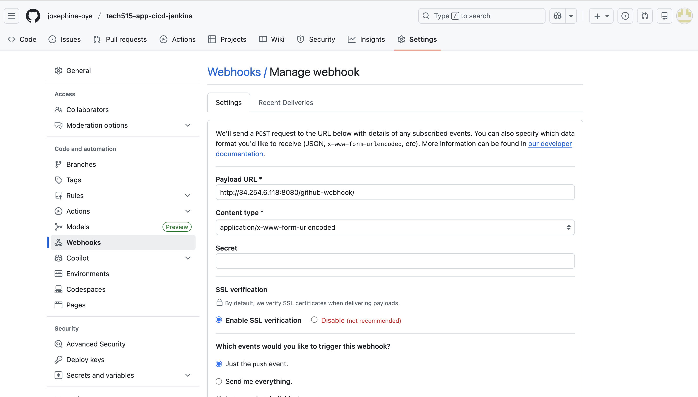

# GitHub Webhook

A GitHub webhook is used to automatically trigger Job 1 whenever code is pushed to the repository.

## Why a webhook is used

- Enables continuous integration
- Removes the need for manual builds
- Ensures tests run immediately after every push


## GitHub Webhook Configuration

In the GitHub repository:

1. Go to **Settings → Webhooks → Add webhook**
2. Payload URL:
```

http://<jenkins-url>/github-webhook/

```
3. Content type:
```

application/json

```
4. Select:
- **Just the push event**
5. Click **Add webhook**



## Jenkins Configuration

In **Job 1 → Configure → Build Triggers**:

Enable:

```

GitHub hook trigger for GITScm polling

```

This allows Jenkins to receive events directly from GitHub.


